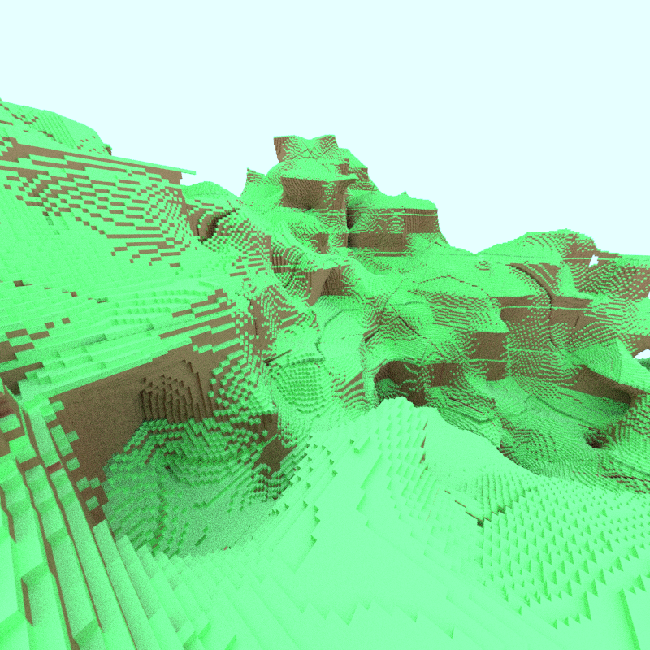
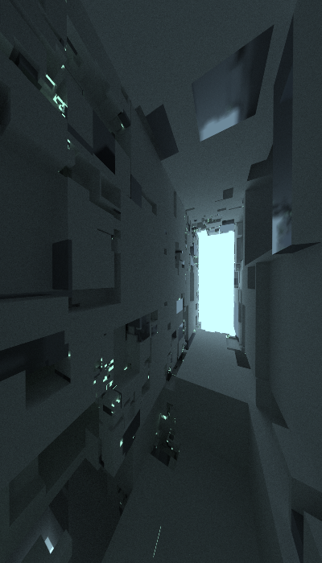
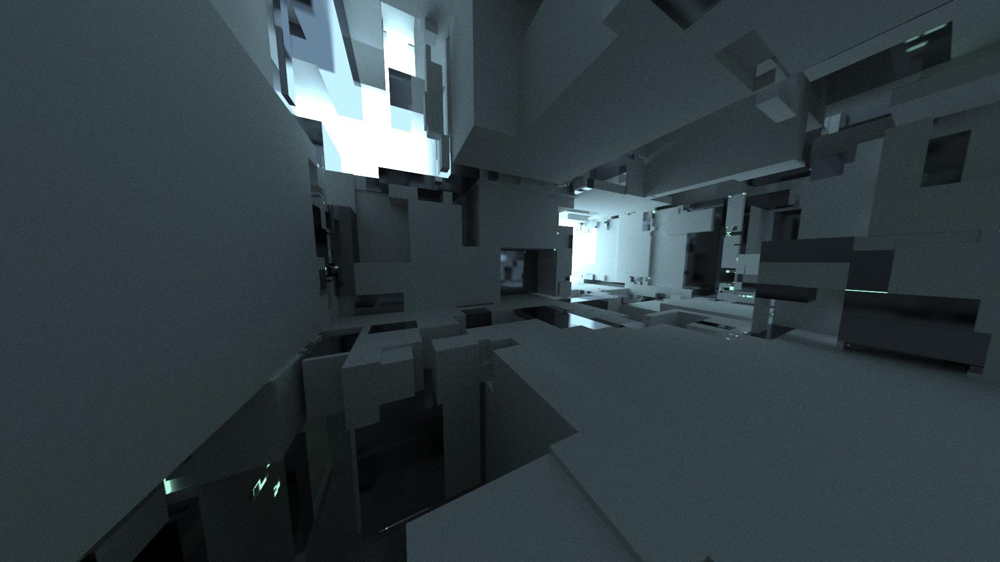

# Readme


## Intro
This is an ongoing project where I prototype various different ideas. At the moment, you can fly around and take raytraced screenshots. More features will be added over time. Since this project is experimental in nature, the code should be thought of as a "rough draft". It is not production-ready in its current state.

## Controls
| Key(s) | Description |
| --- | --- |
| `ESCAPE` | **Escape** the program. |
| `TAB` | Reload resources. This includes shader files and options set in SETTINGS.txt |
| `WASD` | Translate the camera |
| `Q` | Boom the camera upwards relative to the view direction |
| `E` | Boom the camera downwards relative to the view direction |
| `SHIFT` | Hold down while moving to move faster|
| `Arrow Keys` | Rotate the camera |
| `R` | Shoot a **R**ay, allowing rays to build up over time|
| `F` | **F**ire a ray, deleting all previous rays|
| `C` | **C**apture an image|
| `T` | **T**oggle between **Preview Mode** and **Raytracing Mode**|
| `BACKSPACE` | When in **Raytracing Mode**, hold down backspace to cancel the process and go back to interactive mode.|
| `ENTER` | When **Raytracing Mode** completes an image, this will save the resulting image to a file. Any other key will discard the result.|



## Environment
- ./Shaders : Folder with shader code
- ./res : Folder with resources needed by the program
- VKDT.binary : Binary file with premade KD-Tree inside. Will be removed once save files are implemented.

## Settings File
### Basics
This file must be named SETTINGS.txt. The settings file is built out of nested namespaces. Inside of each namespace is a 
list of **Key**:**Value** pairs.
- **Keys** are always strings.
- **Values** can be one of several types.
  - Bool
  - Float
  - Integer
  - String
  - Vec2 (Float or Int)
  - Vec3 (Float or Int)

### Formatting
Comments can be either C/C++ style line or block comments.
Namespaces are declared with the keyword **namespace**, followed by the name. The contents are listed in between brackets. These declarations can be nested inside of each other. Lines can be ended with a semicolon if you're a stickler for that kind of thing.

The contents of an example SETTINGS.txt file are shown below to demonstrate formatting.
```c++
namespace ENGINE{
	/*
	Everything so far is nested inside the ENGINE namespace.
	*/

	ShouldRenderWidgets: true;
	TargetFPS: 15;  // Livin' that laptop lifestyle
	NumWorkerThreads: 10;

	namespace WINDOW{
		// Boolean capitalization works either way
		ShouldStartFullscreen: False  // ;
	};

	namespace WORLD{
		SkyColor: {0.1, 0.1, 0.1};

		namespace CHUNK_GEN{
			Seed: 56;
			GenerationAlgorithm: "NoiseLayers";
			MinBounds: {0, 0, 0};
			MaxBounds: {0, 0, 0};
		};
	};

	namespace RAYTRACING{
		ImageDimensions: {800, 800};
		TileDimensions: {32, 32};
		NumRenderThreads: 3;
		RaysPerPixel: 40;
		MaxPathLen: 5;
	};

	namespace ACCELERATION{
		/*
		Settings for various different acceleration structures
		*/

		namespace VKDTREE{  // Voxel KD-Tree
			MaxDepth: 0;
			MandatoryLeafVolume: 1;
		};

		namespace MKDTREE{  // Mesh KD-Tree
			// TODO: Implement
		};

		namespace VOCTREE{  // Voxel Octree.
			IsSparse: true;
		};
	};
};
```

### Some Useful Settings
These are a non-exhaustive list of settings to use. Since input sanitization has not been implemented yet, there will be errors if the type of the value is different from the one listed in **Value Type**. An example of this would be providing a Float for what should be an Integer.
| Namespace | Key | Value Type | Description |
| --- | --- | --- | --- |
| ENGINE | `TargetFPS` | Integer | The FPS that the program should run at. |
| ENGINE | `NumWorkerThreads` | Integer | Number of worker threads the program can use simultaneously. NOTE: Not currently functional. |
| ENGINE<br>WINDOW | `ShouldStartFullscreen` | Bool | Should the program automatically start in fullscreen mode. |
| ENGINE<br>WORLD<br>CHUNK_GEN | `Seed` | Integer | Seed for the random number generator to start with. |
| ENGINE<br>WORLD<br>CHUNK_GEN | `GenerationAlgorithm` | String | Name of the chunk generation algorithm to use. |
| ENGINE<br>WORLD<br>CHUNK_GEN | `MinBounds` | IVec3 | Coordinates of most negative chunk (in each dimension) to generate. |
| ENGINE<br>WORLD<br>CHUNK_GEN | `MaxBounds` | IVec3 | Coordinates of most positive chunk (in each dimension) to generate. |
| ENGINE<br>RAYTRACING | `ImageDimensions` | IVec2 | Number of (Width, Height) pixels the image should be. |
| ENGINE<br>RAYTRACING | `TileDimensions` | IVec2 | The image will be rendered in tiles instead of all at once. How many (Width, Height) pixels large should they be. |
| ENGINE<br>RAYTRACING | `NumRenderThreads` | Integer | The number of threads that can render simultaneously. |
| ENGINE<br>RAYTRACING | `RaysPerPixel` | Integer | The number of rays fired per pixel. Higher numbers are more realistic but take longer to render. |
| ENGINE<br>RAYTRACING | `MaxPathLen` | Integer | The maximum number of path segments any given ray can travel before terminating |
| ENGINE<br>RAYTRACING | `SkyColor` | FVec3 | The (0 - 1) range RGB color components of the sky. |
| ENGINE<br>RAYTRACING | `SunColor` | FVec3 | The (0 - 1) range RGB color components of the sun. |
| ENGINE<br>RAYTRACING | `SkyBrightnessMultiplier` | Float | Can be set above 1 as a cheap imitation of HDR lighting. |
| ENGINE<br>RAYTRACING | `SunBrightnessMultiplier` | Float | Can be set above 1 as a cheap imitation of HDR lighting. |
| ENGINE<br>RAYTRACING | `SunDirection` | FVec3 | The direction a ray needs to point in to be considered "in sunlight". |
| ENGINE<br>ACCELERATION<br>VKDTREE | `MaxDepth` | Integer | The maximum depth of the KD-Tree before the tree builder gives up. |
| ENGINE<br>ACCELERATION<br>VKDTREE | `MandatoryLeafVolume` | Integer | Any leaf nodes less than or equal to this size forces the tree builder to make a leaf node. |



## Rough Program Structure
### Engine
Responsible for running the render loop and managing subsystems. Right now this class is filled with temporary placeholder code.

### Renderer
The renderer is a wrapper class around "modules" for different rendering APIs. For now only OpenGL is supported, but further down the line it should be possible to add others such as Vulkan. The Raytracer class will be moved into the Renderer in a future update.

### Raytracer
At the moment there are two modes the raytracer can operate under.
- **Raytracing Mode**
  - Breaks the image up into tiles which are rendered in parallel. The screen is updated as tiles complete so the user can track the progress of a render.
  - Holding `BACKSPACE` will cancel a render.
  - Higher values of `RaysPerPixel` and `MaxPathLen` will result in higher quality images but longer render times.
- **Preview Mode**
  - Takes a quick snapshot with no lighting information. Used to preview shots before committing to a time-consuming render.

### WorldState
Packages any information about the world that should persist between runs of the program. Eventually, it should be possible to convert back and forth between this and a binary save file.

### SimCache
Stores data structures meant to speed up the world simulation process. At the moment, only raytracing-related functionality is present. Once entities and physics are implemented their acceleration structures will go here.
